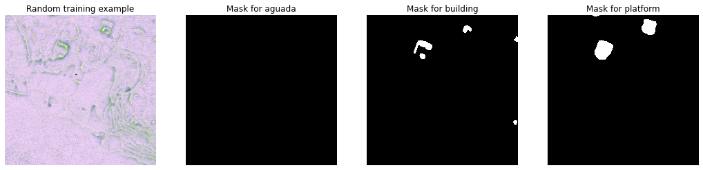
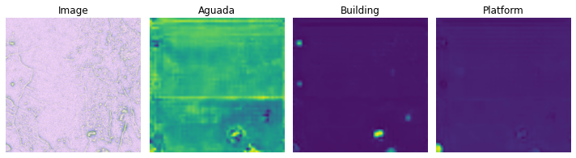
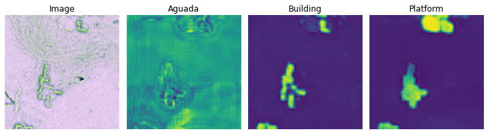
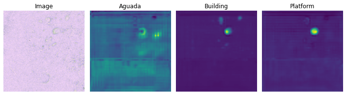
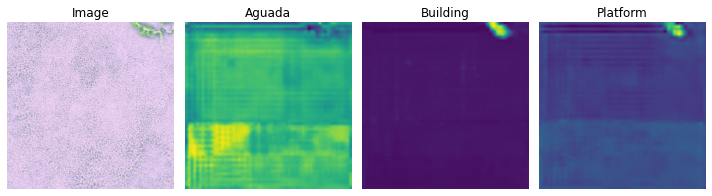

## Example of the DeepLabV3 (benchmark) solution with the `aitlas` toolbox, using *only* lidar data

*Note: Datasets and model paths should be reconfigured*


```python
%matplotlib inline
```

Import the required packages


```python
import matplotlib.pyplot as plt
from PIL import Image
import os

from aitlas.datasets import ChactunDataset
from aitlas.models import DeepLabV3
from aitlas.tasks.predict import ImageFolderDataset
from aitlas.visualizations import display_image_segmentation
```

    2021-04-27 09:15:20,168 INFO Loading faiss with AVX2 support.
    2021-04-27 09:15:20,169 INFO Loading faiss.
    

## Visualize images and masks

```python
example_image = Image.open('/media/ssd/Chactun/train/tile_1185_lidar.tif')
example_mask1 = Image.open('/media/ssd/Chactun/train/tile_1185_mask_aguada.tif')
example_mask2 = Image.open('/media/ssd/Chactun/train/tile_1185_mask_building.tif')
example_mask3 = Image.open('/media/ssd/Chactun/train/tile_1185_mask_platform.tif')

plt.rcParams["figure.figsize"] = (18, 9) # (w, h)
plt.subplot(1,4,1)
plt.imshow(example_image)
plt.title(f"Random training example")
plt.axis('off')
plt.subplot(1,4,2)
plt.imshow(example_mask1, cmap='gray')
plt.title(f"Mask for aguada")
plt.axis('off')
plt.subplot(1,4,3)
plt.imshow(example_mask2, cmap='Greys',  interpolation='nearest')
plt.title(f"Mask for building")
plt.axis('off')
plt.subplot(1,4,4)
plt.imshow(example_mask3, cmap='Greys',  interpolation='nearest')
plt.title(f"Mask for platform")
plt.axis('off')
plt.show()
```


    

    
*Note: The visualised example tiles are different from the traning data used next.*

## Load data


```python
train_dataset_config = {
    "batch_size": 4,
    "shuffle": True,
    "num_workers": 4,
    "root": "/media/ssd/chactun_new/train",
    "transforms": ["aitlas.transforms.MinMaxNormTransponse"],
    "target_transforms": ["aitlas.transforms.MinMaxNorm"]
}
train_dataset = ChactunDataset(train_dataset_config)
len(train_dataset)
```


    1764


## Training


```python
epochs = 5
model_directory = "/media/ssd/chactun_new/experiments/"
model_config = {"num_classes": 3, "learning_rate": 0.0001,"pretrained": True, "threshold": 0.5}

model = DeepLabV3(model_config)
model.prepare()

model.train_model(
    train_dataset=train_dataset,
    epochs=epochs,
    model_directory=model_directory,
    run_id='1'
)

```

    2021-04-27 00:19:59,886 INFO Starting training.
    training:  22%|██▏       | 99/441 [05:59<20:47,  3.65s/it]2021-04-27 00:26:02,881 INFO [1, 100], loss:  0.06564
    ...
    training: 100%|██████████| 441/441 [26:48<00:00,  3.65s/it]
    2021-04-27 00:46:48,651 INFO epoch: 1, time: 1609, loss:  0.00953
    testing on train set: 100%|██████████| 441/441 [02:08<00:00,  3.44it/s]
    2021-04-27 00:48:57,793 INFO IOU mean:0.722846107463058, IOU pre Class:0.963718820861678, 0.6328794900102218, 0.5719399468897979
    training:  22%|██▏       | 99/441 [06:01<20:50,  3.66s/it]2021-04-27 00:55:03,407 INFO [2, 100], loss:  0.02723
    ...
    training:  90%|█████████ | 399/441 [24:18<02:33,  3.66s/it]2021-04-27 01:13:20,144 INFO [2, 400], loss:  0.02262
    training: 100%|██████████| 441/441 [26:52<00:00,  3.66s/it]
    2021-04-27 01:15:50,057 INFO epoch: 2, time: 1613, loss:  0.00586
    testing on train set: 100%|██████████| 441/441 [02:08<00:00,  3.44it/s]
    2021-04-27 01:17:58,154 INFO IOU mean:0.7841773900757821, IOU pre Class:0.9749535495805229, 0.6798431581490628, 0.6977353923868408
    training:  22%|██▏       | 99/441 [06:02<20:49,  3.65s/it]2021-04-27 01:24:03,835 INFO [3, 100], loss:  0.02000
    ...
    training:  90%|█████████ | 399/441 [24:18<02:33,  3.66s/it]2021-04-27 01:42:20,296 INFO [3, 400], loss:  0.01801
    training: 100%|██████████| 441/441 [26:52<00:00,  3.66s/it]
    2021-04-27 01:44:50,158 INFO epoch: 3, time: 1612, loss:  0.00484
    testing on train set: 100%|██████████| 441/441 [02:08<00:00,  3.44it/s]
    2021-04-27 01:46:58,220 INFO IOU mean:0.7981491227573029, IOU pre Class:0.9783444103960143, 0.6893239246984646, 0.726778961817339
    training:  22%|██▏       | 99/441 [06:01<20:50,  3.66s/it]2021-04-27 01:53:03,798 INFO [4, 100], loss:  0.01688
    ...
    training:  90%|█████████ | 399/441 [24:18<02:33,  3.65s/it]2021-04-27 02:11:20,609 INFO [4, 400], loss:  0.01528
    training: 100%|██████████| 441/441 [26:52<00:00,  3.66s/it]
    2021-04-27 02:13:50,537 INFO epoch: 4, time: 1612, loss:  0.00410
    testing on train set: 100%|██████████| 441/441 [02:08<00:00,  3.44it/s]
    2021-04-27 02:15:58,757 INFO IOU mean:0.7656495129726879, IOU pre Class:0.9009452958445038, 0.6471059282655858, 0.7488972463535754
    training:  22%|██▏       | 99/441 [06:02<20:50,  3.66s/it]2021-04-27 02:22:04,521 INFO [5, 100], loss:  0.01717
    ...
    training:  90%|█████████ | 399/441 [24:19<02:33,  3.66s/it]2021-04-27 02:40:21,447 INFO [5, 400], loss:  0.01773
    training: 100%|██████████| 441/441 [26:52<00:00,  3.66s/it]
    2021-04-27 02:42:51,372 INFO epoch: 5, time: 1613, loss:  0.00398
    testing on train set: 100%|██████████| 441/441 [02:08<00:00,  3.44it/s]
    2021-04-27 02:44:59,516 INFO IOU mean:0.8102525932986878, IOU pre Class:0.9751825387042666, 0.6866169919191476, 0.7689581768304244
    2021-04-27 02:45:01,657 INFO finished training. training time: 8702
    

## Evaluation


```python
test_dataset_config = {
    "batch_size": 4,
    "shuffle": False,
    "num_workers": 4,
    "root": "/media/ssd/chactun_new/test",
    "transforms": ["aitlas.transforms.MinMaxNormTransponse"],
    "target_transforms": ["aitlas.transforms.MinMaxNorm"]
}

test_dataset = ChactunDataset(test_dataset_config)
len(test_dataset)

model_config = {"num_classes": 3, "learning_rate": 0.0001,"pretrained": True, "threshold": 0.5}
model = DeepLabV3(model_config)
model.prepare()

model_path = "/media/ssd/chactun_new/experiments/checkpoint.pth.tar"
model.evaluate(dataset=test_dataset, model_path=model_path)
model.running_metrics.get_scores(["iou"])
```

    2021-04-27 12:20:58,762 INFO Loading checkpoint /media/ssd/chactun_new/experiments/checkpoint.pth.tar
    2021-04-27 12:20:59,179 INFO Loaded checkpoint /media/ssd/chactun_new/experiments/checkpoint.pth.tar at epoch 6
    testing on test set: 100%|██████████| 83/83 [00:23<00:00,  3.59it/s]
    


    [{'IOU mean': 0.7552414536974308,
      'IOU pre Class': [0.9681466025127647,
       0.6427991823958499,
       0.6547785086598316]}]


## Predictions


```python
# run predictions
model_path = "/media/ssd/chactun_new/experiments/checkpoint.pth.tar"
predict_dir = "/media/ssd/chactun_new/predict/"
results_dir = "/media/ssd/chactun_new/experiments/results"
labels = ["Aguada", "Building", "Platform"]
transforms = ["aitlas.transforms.MinMaxNormTransponse"]

predict_dataset = ImageFolderDataset(predict_dir, labels, transforms)
len(predict_dataset)

# load the model
model.load_model(model_path)

# Run predictions
y_true, y_pred, y_prob = model.predict(dataset=predict_dataset)

# plot predictions
for i, image_path in enumerate(predict_dataset.data):
    plot_path = os.path.join(results_dir, f"{predict_dataset.fnames[i]}_plot.png")
    display_image_segmentation(
        image_path,
        y_true[i],
        y_pred[i],
        y_prob[i],
        predict_dataset.labels,
        plot_path,
    )
```

    2021-04-27 09:17:44,395 INFO Loading checkpoint /media/ssd/chactun_new/experiments/checkpoint.pth.tar
    2021-04-27 09:17:44,736 INFO Loaded checkpoint /media/ssd/chactun_new/experiments/checkpoint.pth.tar at epoch 6
    running prediction: 100%|██████████| 1/1 [00:00<00:00,  2.48it/s]
    


    

    


    

    


    

    


    

    

